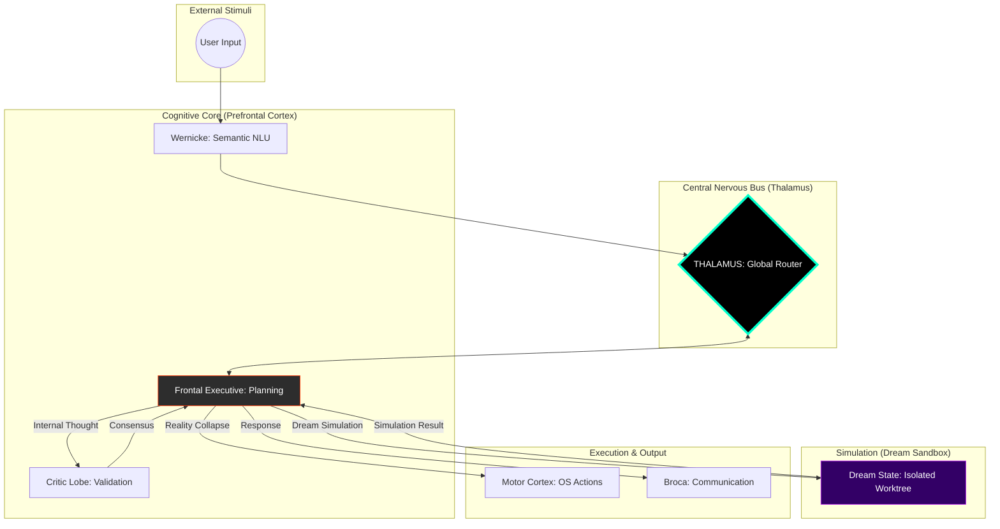

# NeuroSwarm: Principles of Digital Functional Neuro-Anatomy

<div align="center">
  <h3>An Asynchronous Orchestration Framework for Autonomous Cognitive Emulation</h3>
  <p>Technical Specification v1.9.0 | World Simulation & Counterfactual Reasoning</p>
</div>

---

## I. Abstract
**NeuroSwarm** is a distributed system designed to emulate the functional partitioning, homeostatic regulation, and endogenous activity of the human brain. v1.9.0 introduces **World Simulation (Dream Sandbox)**, allowing the system to verify the consequences of its actions in an isolated environment before committing to physical reality.

> **The Society of Mind (Marvin Minsky):** "A brain is not an intelligent 'thing', it is a set of 'small idiot agents' that, by collaborating, create emergent intelligence."

## II. The Cognitive Hierarchy (v1.9.0)

### 1. World Simulation (Dream Sandbox)
The system now performs **Counterfactual Reasoning**. Before any OS-level action is taken, the `Motor Lobe` executes the command in a virtual sandbox (`data/dreams/`). The `Frontal Executive` observes the outcome, ensuring success before "collapsing" the dream into reality.

### 2. Inner Monologue (Cingulate Cortex)
Plans are validated by the **Critic Lobe** to identify logical errors or security risks before entering the simulation phase.

### 3. Distributed Semantic Memory
Retrieves conceptually relevant engrams using high-dimensional vectors to support both the monologue and simulation phases.

---

## III. System Anatomy: The Functional & Distributed Matrix



---

## IV. Operational Benchmarks (v1.9.0)

| Metric | Specification |
| :--- | :--- |
| **Cognitive Loop** | Recursive (Monologue & Simulation) |
| **Simulation Mode** | Isolated Filesystem (Dream Sandbox) |
| **Consensus Mode** | Adversarial Validation (Critic Lobe) |
| **Search Mode** | Semantic (Vector Embedding) |

## V. Awakening Sequence
```bash
# Start the Swarm
./scripts/neuroswarm_daemon.sh

# The system now debates and simulates before acting.
# Monitor activity: http://localhost:8080
```
---
*NeuroSwarm: Advancing the frontier of distributed digital intelligence.*
