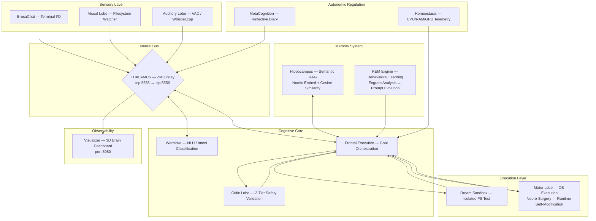

# NeuroSwarm: Distributed Cognitive Architecture

<div align="center">
  
  
  
  
  <br><br>
  <h3>A biomimetic multi-agent framework for autonomous cognitive emulation</h3>
  <p><em>Emergent intelligence through specialised cortical processes connected via a neural message bus</em></p>
</div>

---

<div align="center">
  
  <br>
  <sub>Real-time 3D neural mesh dashboard — anatomical lobes, live activity arcs, event stream</sub>
</div>

---

## I. Core Concept

NeuroSwarm rejects the monolithic LLM paradigm. Rather than delegating all cognition to a single large model, it implements Marvin Minsky's **Society of Mind** hypothesis: a population of small, specialised processes collaborating through a shared neural bus, producing emergent goal-directed behaviour from their interactions.

Each *lobe* is an independent OS process with a precisely scoped cognitive function. Communication is exclusively via ZeroMQ PUB/SUB. No lobe has visibility into the internals of another — only the message schema is shared. This yields a system that is:

- **Modular** — lobes can be added, removed, or hot-swapped at runtime via `dlopen`
- **Fault-tolerant** — any single lobe crash does not halt the system
- **Observable** — all inter-lobe state is visible on the bus
- **Extensible** — new capabilities are compiled as `.so` files and injected dynamically (Neuro-Surgery)

> *"A brain is not an intelligent 'thing' — it is a set of small idiot agents that, by collaborating, produce emergent intelligence."* — Marvin Minsky

---

## II. Architecture



---

## III. The Cognitive Cycle

Every stimulus follows a deterministic pipeline:

```
1. Stimulus arrives (user input / visual change / Ralph task scheduler)
2. FrontalExecutive queries Hippocampus → retrieves semantically similar past experiences
3. FE constructs a plan via grammar-constrained LLM inference (GBNF → compact JSON)
4. CriticLobe validates the plan:
      Tier 1 — rule-based blacklist (instant reject for destructive commands)
      Tier 2 — LLM evaluation via SynapticController
5. APPROVED → Dream Sandbox executes the command in an isolated filesystem
6. Dream success → Reality Collapse: MotorLobe executes the command in the live environment
7. Proprioceptive feedback (stdout, exit code) returned to FrontalExecutive
8. Hippocampus indexes the successful execution with a Nomic-Embed vector
9. Idle period → REM Engine analyses engram traces, rewrites the behavioural prompt
```

---

## IV. Self-Improvement: The Ralph Loop

NeuroSwarm includes a structured autonomous self-improvement mechanism — the **Ralph loop** — driven by `tasks.json`.

```json
{
  "tasks": [
    {
      "id": "NS-001",
      "description": "Generate a process inventory of all running NeuroSwarm components.",
      "priority": 1,
      "passes": true,
      "completed_at": "2026-03-17T04:22:11Z"
    },
    {
      "id": "NS-002",
      "description": "Verify neural bus health by publishing a diagnostic ping.",
      "priority": 2,
      "passes": false
    }
  ]
}
```

Each autonomous cycle:
1. `pick_next_task()` selects the highest-priority unresolved task
2. Hippocampus is queried for relevant prior experience
3. FrontalExecutive generates a plan and submits it for Critic validation
4. The plan is tested in the Dream Sandbox, then executed in reality
5. On success: `mark_task_complete()` sets `passes: true`, appends to `progress.txt`, and issues an automatic `git commit` — creating a verifiable audit trail of autonomous achievements

---

## V. Memory Architecture

NeuroSwarm maintains two complementary memory systems:

**Episodic Memory (Hippocampus)**
Every successful command execution is embedded with `nomic-embed-text-v1.5` (137M parameters, dedicated inference context) and stored in `data/engrams/memory_index.jsonl`. New tasks query this index via L2-normalised cosine similarity. The system reuses solutions it has already discovered, effectively accumulating procedural knowledge without weight updates.

**Behavioural Learning (REM Engine)**
During sleep cycles — triggered by Homeostasis when system load drops below threshold — the REM Engine analyses the last 100 execution traces:
- Computes success rate stratified by execution mode (reality / dream / neuro_surgery)
- Identifies command patterns correlated with success and failure
- Synthesises findings into `data/system_knowledge.md`
- Broadcasts a `prompt_update` event; FrontalExecutive injects this context into all subsequent prompts

The system never modifies model weights. It improves by accumulating richer context — a form of in-context meta-learning.

---

## VI. Neuro-Surgery: Runtime Self-Modification

The system is capable of modifying and extending its own implementation at runtime:

1. FrontalExecutive generates a patch (shell command sequence targeting source files)
2. CriticLobe validates the patch
3. MotorLobe executes: `patch source → cmake → make -j$(nproc)` inside the `neuro_surgery` execution mode
4. On successful build, CerebralMatrix `dlopen`s the new `.so` and injects it as a live lobe

This enables capability acquisition without system restart — analogous to axonal sprouting in biological neural development.

---

## VII. Component Map

| Process | Binary | Cognitive Function |
|---|---|---|
| **Thalamus** | `thalamus` | ZMQ relay — all messages transit this single bottleneck |
| **SynapticController** | `synaptic_controller` | LLM inference server — Phi-4-mini (generative) + Nomic-Embed (semantic) |
| **FrontalExecutive** | `frontal_executive` | Orchestrator — goal management, memory retrieval, plan generation |
| **CriticLobe** | `critic_lobe` | Two-tier plan validation: rule blacklist + LLM ethical review |
| **MotorLobe** | `motor_lobe` | Command execution, dream sandbox isolation, neuro-surgery mode |
| **Hippocampus** | `hippocampus` | Semantic episodic memory — embedding index + cosine retrieval |
| **REM Engine** | `rem_engine` | Sleep-cycle learning — engram analysis + behavioural prompt evolution |
| **Homeostasis** | `homeostasis` | System telemetry — CPU/RAM/GPU monitoring + stress signalling |
| **WernickeLobe** | `wernicke_lobe` | Natural language understanding — intent classification, entity extraction |
| **Amygdala** | `amygdala` | Emotional gating — priority assignment and stress tagging |
| **MetaCognition** | `metacognition` | Self-reflective diary — internal state narration |
| **VisualLobe** | `visual_lobe` | Filesystem watcher — detects environmental state changes |
| **AuditoryLobe** | `auditory_lobe` | Voice input pipeline via Whisper.cpp |
| **Visualizer** | `visualizer` | 3D neural mesh dashboard (Three.js, port 8080) |
| **ChronosLobe** | `chronos_lobe` | Temporal awareness — broadcasts time_pulse with ISO timestamp, uptime, circadian phase |
| **StatisticsLobe** | `statistics_lobe` | Passive bus observer — records per-cycle metrics to `data/metrics/` in JSONL |
| **CerebralMatrix** | `CerebralMatrix` | Process supervisor — forks all lobes, handles runtime injection |

---

## VIII. Message Protocol

Every message on the neural bus is a JSON object with these mandatory fields:

```json
{
  "cid":    "uuid4 — correlation identifier, threads related messages",
  "origin": "source lobe name",
  "intent": "semantic action descriptor"
}
```

Core intents:

| Intent | Direction | Description |
|---|---|---|
| `stimulus` | → FE | Raw user or sensor input |
| `inference_request` | → SC | Request LLM generation |
| `inference_result` | SC → | Generated text response |
| `critic_validate` | → CL | Plan submitted for safety review |
| `critic_result` | CL → | APPROVED or rejection rationale |
| `execution_request` | → ML | Command to execute |
| `execution_result` | ML → | stdout, exit code, mode |
| `search_memory` | → HP | Semantic query |
| `search_result` | HP → | Top-k similar engrams |
| `prompt_update` | REM → | Evolved behavioural context |
| `initiate_sleep_cycle` | HM → | Trigger REM processing |
| `time_pulse` | CH → | ISO timestamp, uptime, time-of-day, is_night |

Full specification: [`docs/SYNAPTIC_PROTOCOL.md`](docs/SYNAPTIC_PROTOCOL.md)

---

## IX. Stack

| Layer | Technology |
|---|---|
| **Neural Bus** | ZeroMQ 4.x — PUB/SUB, non-blocking |
| **Inference** | llama.cpp (Vulkan/GPU offload) — Phi-4-mini-instruct Q4_K_M |
| **Embeddings** | nomic-embed-text-v1.5 Q8_0 — dedicated 137M model, mean pooling |
| **Memory Index** | L2-normalised cosine similarity over JSONL (zero external dependencies) |
| **Grammar Constraints** | GBNF — llama.cpp grammar-constrained decoding for structured JSON output |
| **Safety** | Two-tier CriticLobe + Dream Sandbox filesystem isolation |
| **Self-Modification** | GCC shared object compilation + `dlopen` runtime injection |
| **Observability** | Three.js r128 + cpp-httplib — 3D anatomical brain mesh, live arc particles |
| **Build System** | CMake 3.16+ / C++17 |
| **OS** | Linux (Vulkan compute) |

---

## X. Deployment

```bash
# 1. Build
mkdir build && cd build
cmake .. && make -j$(nproc)
cd ..

# 2. Download models (first time only)
python3 -c "
from huggingface_hub import hf_hub_download
# Primary: Phi-4-mini — best quality/size ratio for <12GB VRAM
hf_hub_download('unsloth/Phi-4-mini-instruct-GGUF',
                'Phi-4-mini-instruct-Q4_K_M.gguf', local_dir='models')
# Semantic memory
hf_hub_download('nomic-ai/nomic-embed-text-v1.5-GGUF',
                'nomic-embed-text-v1.5.Q8_0.gguf', local_dir='models')
"

# 3. Launch all processes
bash start_agi.sh

# 4. Open a conversation
./build/broca_chat

# 5. Monitor (browser)
xdg-open http://localhost:8080
```

**Hardware requirements:** GPU with Vulkan support, ≥8GB VRAM recommended. Tested on GTX 1080 Ti (11GB). CPU fallback available.

---

## XI. Roadmap

- [x] **Ralph loop** — `tasks.json`-driven autonomous self-improvement with `git commit` audit trail
- [x] **Phi-4-mini** — primary generative model (3.8B, Q4_K_M, 2.4GB)
- [x] **Dream Sandbox** — isolated filesystem execution before reality deployment
- [x] **Neuro-Surgery** — runtime C++ lobe compilation and `dlopen` injection
- [x] **3D Dashboard** — Three.js anatomical brain mesh with live neural arc visualisation
- [x] **GBNF grammar constraints** — structured JSON output from LLM inference
- [ ] **Adversarial Critic** — replace self-validating LLM prompt with an adversarial framing ("assume this plan is malicious, find the attack vector") to break circular self-approval
- [ ] **Hybrid inference** — route FrontalExecutive planning through an external API (Claude/GPT) for high-reliability reasoning while retaining local llama.cpp for embeddings and lightweight tasks; implemented as a new SynapticController adapter
- [x] **Autonomous task generation** — at the end of each successful Ralph cycle, FrontalExecutive infers the next useful task from system state and appends it to `tasks.json`, closing the autonomy loop without human intervention. Implementation: after `mark_task_complete()`, FE queries Hippocampus for capability gaps (tasks attempted but failed + engrams not yet covered), constructs a prompt *"given what the system knows how to do, what is the most useful next capability to acquire?"*, generates a new task entry with `priority`, `description`, and `acceptance_criteria` fields, and appends it to `tasks.json`. The description must be concrete enough for a small model to execute — vague goals are the primary failure mode of the current human-authored task list
- [x] **ChronosLobe** — temporal awareness for the swarm: broadcasts a `time_pulse` event every second containing ISO timestamp, system uptime, time-of-day, and day-of-week. FrontalExecutive injects current time and task elapsed duration into every prompt, enabling the model to reason about urgency and task staleness. Hippocampus uses timestamps for memory decay — recent engrams weighted higher than stale ones. Foundation for circadian scheduling in Homeostasis (reduced activity at night, deeper REM cycles)
- [x] **StatisticsLobe** — passive bus observer that records per-cycle metrics to `data/metrics/` in JSONL (Ralph cycle duration, retry count, Critic decisions, Hippocampus similarity scores, inference tokens/sec). Zero interference with cognition. Required for empirical evaluation and eventual academic publication
- [ ] **Polecat workers** — ephemeral genesis lobes spawned per task, auto-terminate on completion
- [ ] **Specialised routing** — Qwen-Coder for MotorLobe commands, critic-fine-tuned model for safety validation
- [ ] **Python-generated lobes** — lower barrier for small models to author new capabilities
- [ ] **REM fine-tuning** — LoRA fine-tune on accumulated successful execution traces

---

*Intelligence is not in the size of the model. It is in the complexity of the connections.*
