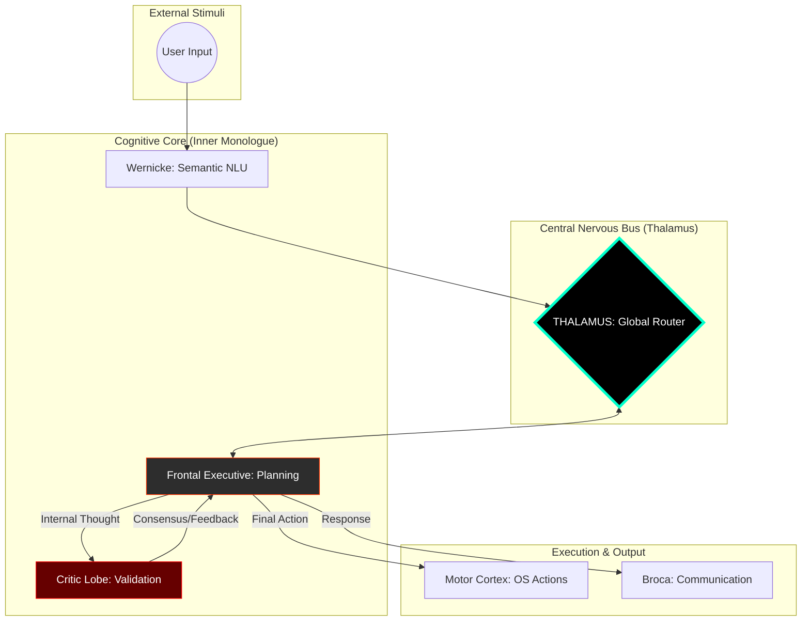

# NeuroSwarm: Principles of Digital Functional Neuro-Anatomy

<div align="center">
  <h3>An Asynchronous Orchestration Framework for Autonomous Cognitive Emulation</h3>
  <p>Technical Specification v1.8.0 | Inner Monologue & Synaptic Consensus</p>
</div>

---

## I. Abstract
**NeuroSwarm** is a distributed system designed to emulate the functional partitioning, homeostatic regulation, and endogenous activity of the human brain. v1.8.0 implements the **Inner Monologue**, a recurring feedback loop where multiple specialized agents must reach a consensus before physical action is taken.

> **The Society of Mind (Marvin Minsky):** "A brain is not an intelligent 'thing', it is a set of 'small idiot agents' that, by collaborating, create emergent intelligence."

## II. The Cognitive Hierarchy (v1.8.0)

### 1. Inner Monologue (Cingulate Cortex)
The system no longer acts on impulse. Every plan generated by the Executive is validated by the **Critic Lobe**. This creates a "monologue" where the system debates with itself until a logical consensus is reached.

### 2. Synaptic Consensus
*   **Criticism:** The `CriticLobe` identifies flaws, security risks, or logical fallacies.
*   **Refinement:** The `FrontalExecutive` incorporates feedback and re-thinks the strategy.
*   **Approval:** Only an `APPROVED` signal allows the transition from thought to execution.

### 3. Distributed Semantic Memory
Memory is stored as high-dimensional vectors, allowing the Hippocampus to retrieve conceptually relevant engrams to support the internal monologue.

---

## III. System Anatomy: The Functional & Distributed Matrix



---

## IV. Operational Benchmarks (v1.8.0)

| Metric | Specification |
| :--- | :--- |
| **Cognitive Loop** | Recursive (Monologue Enabled) |
| **Consensus Mode** | Adversarial Validation (Critic Lobe) |
| **Search Mode** | Semantic (Vector Embedding) |
| **Node Support** | Distributed (TCP/IP) |

## V. Awakening Sequence
```bash
# Start the Swarm
./scripts/neuroswarm_daemon.sh

# The system now debates internally before responding. 
# You can monitor this in http://localhost:8080
```
---
*NeuroSwarm: Advancing the frontier of distributed digital intelligence.*
