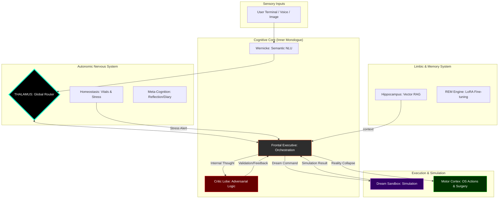

# NeuroSwarm: Principles of Digital Functional Neuro-Anatomy

<div align="center">
  
  
  
  <br>
  <h3>An Asynchronous Orchestration Framework for Autonomous Cognitive Emulation</h3>
</div>

---

## I. Abstract: The Society of Mind
**NeuroSwarm** is a biomimetic framework that rejects the paradigm of monolithic AI. Instead of relying on a single "god-model," it implements Marvin Minsky's **Society of Mind** theory: intelligence is not a single process, but the emergent result of many "small idiot agents" (specialized SLMs) collaborating through feedback loops.

> "A brain is not an intelligent 'thing', it is a set of 'small idiot agents' that, by collaborating, create emergent intelligence." — *Marvin Minsky*

## II. The Cognitive Hierarchy (v2.0.0)

### 1. Epistemic Drive (Intention & Curiosity)
The system is no longer purely reactive. When idle, the **Default Mode Network (DMN)** triggers self-assigned learning goals. The system explores its environment and codebases autonomously to "satisfy" its curiosity drive.

### 2. Inner Monologue & Consensus
Every plan goes through an adversarial validation cycle:
*   **The Proposer (Frontal Executive):** Synthesizes goals into actions.
*   **The Validator (Critic Lobe):** Analyzes the plan for security risks, logical fallacies, and efficiency.
*   **Consensus:** Action only occurs when the Critic grants `APPROVED` status.

### 3. World Simulation (Dream Sandbox)
NeuroSwarm performs **Counterfactual Reasoning**. It simulates its actions in an isolated filesystem (`data/dreams/`) before "collapsing the dream" into physical reality. This ensures 100% safety and predictability in system-level operations.

### 4. Neuro-Surgery (Live Self-Modification)
The system can alter its own source code. The Executive can write new C++ Lobes, inject them into the CMake build system, and trigger a live recompilation of the Matrix without downtime.

---

## III. System Anatomy (Neural Bus Topology)

The following diagram illustrates the flow of a single stimulus through the matrix:



---

## IV. Technical Specification

| Subsystem | Technology | Function |
| :--- | :--- | :--- |
| **Neural Bus** | ZeroMQ (PUB/SUB) | Nanosecond inter-lobe routing. |
| **Inference** | llama.cpp (CPU/Vulkan) | LoRA Multiplexing of 1.5B - 8B models. |
| **Memory** | Neural Vector Search | Semantic retrieval via cosine similarity. |
| **Observability** | 3D Neural Mesh (Three.js) | Real-time EEG visual monitoring (8080). |
| **Safety** | Isolated Dream Sandbox | Pre-execution verification of bash/python. |

## V. Deployment & Awakening

```bash
# 1. Compile the Matrix
mkdir build && cd build
cmake .. && make -j$(nproc)

# 2. Activate the Daemon
./scripts/neuroswarm_daemon.sh

# 3. Enter the Mind
./build/broca_chat
```

---
*True AGI is not found in the size of the model, but in the complexity of the connections.*
