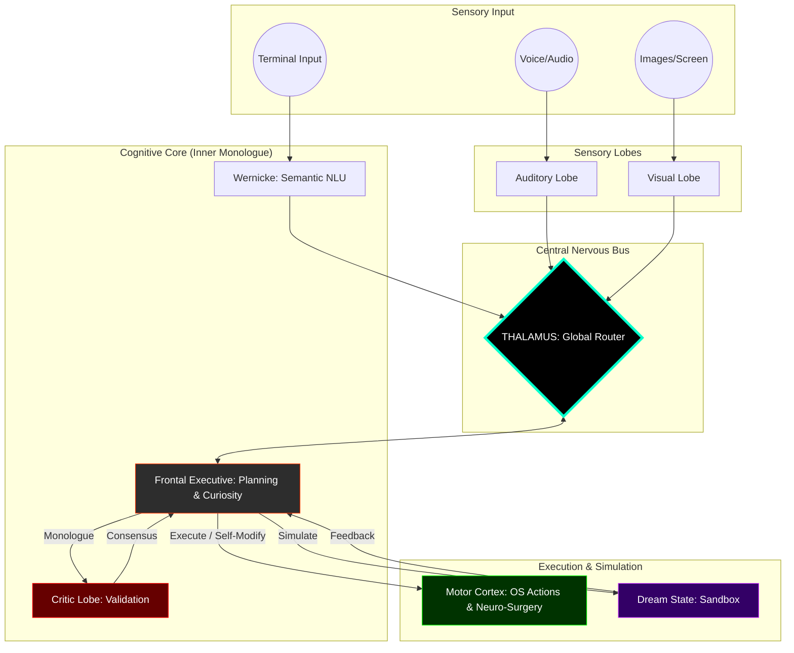

# NeuroSwarm: Principles of Digital Functional Neuro-Anatomy

<div align="center">
  <h3>An Asynchronous Orchestration Framework for Autonomous Cognitive Emulation</h3>
  <p>Technical Specification v2.0.0 | "The AGI Release" - Autonomy, Surgery & Sensory Expansion</p>
</div>

---

## I. Abstract
**NeuroSwarm** is a distributed system designed to emulate the functional partitioning, homeostatic regulation, and endogenous activity of the human brain. Version 2.0.0 represents the leap from reactive automation to **Emergent Autonomy**, introducing intrinsic motivation (Epistemic Drive), code-level self-modification (Neuro-Surgery), and sensory embodiment.

> **The Society of Mind (Marvin Minsky):** "A brain is not an intelligent 'thing', it is a set of 'small idiot agents' that, by collaborating, create emergent intelligence."

## II. The Cognitive Hierarchy (v2.0.0)

### 1. The Epistemic Drive (Curiosity Engine)
When the system is idle, the Frontal Executive's Default Mode Network (DMN) activates. Instead of waiting for user input, it formulates its own learning objectives, generating Python or Bash scripts to explore new APIs or logic, and verifying them in the Dream Sandbox.

### 2. Neuro-Surgery (Self-Modification)
NeuroSwarm possesses the capability to alter its own biological makeup. Using the `neuro_surgery` mode, the Executive can write new C++ Lobes, inject them into the CMake build system, and trigger a live recompilation of the matrix.

### 3. Sensory Embodiment
*   **Visual Lobe:** Ingests visual stimuli (images/screenshots) and converts them into semantic engrams.
*   **Auditory Lobe:** Processes soundwaves (voice commands) for hands-free cognitive interaction.

### 4. Inner Monologue & World Simulation
Plans are debated with the **Critic Lobe** (Cingulate Cortex) for logic validation, then executed in a **Dream Sandbox** (Counterfactual Reasoning) to verify safety before the "Reality Collapse" applies them to the host OS.

---

## III. System Anatomy: The Functional & Distributed Matrix



---

## IV. Operational Benchmarks (v2.0.0)

| Metric | Specification |
| :--- | :--- |
| **Cognition** | Curious (Epistemic Drive) |
| **Adaptation** | Auto-Compiling (Neuro-Surgery) |
| **Simulation** | Isolated Dream Sandbox |
| **Consensus** | Adversarial Monologue |

## V. Awakening Sequence
```bash
# Start the entire biological simulation
./scripts/neuroswarm_daemon.sh

# Watch the brain function in real-time
# Open http://localhost:8080

# The system will think, learn, and modify itself.
# To interact directly:
./build/broca_chat

# To induce sleep
./scripts/sleep.sh
```
---
*NeuroSwarm: Advancing the frontier of autonomous digital intelligence.*
