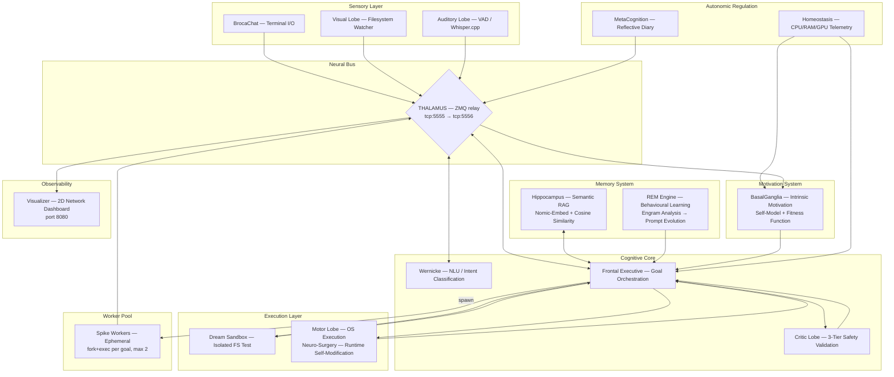

# NeuroSwarm: Distributed Cognitive Architecture

<div align="center">
  
  
  
  
  <br><br>
  <h3>A biomimetic multi-agent framework for autonomous cognitive emulation</h3>
  <p><em>Emergent intelligence through specialised cortical processes connected via a neural message bus</em></p>
</div>

---

<div align="center">
  
  <br>
  <sub>Real-time cognitive dashboard — 2D network graph with density clusters, Maslow drive hierarchy, neurogenesis metrics, spike task ticker</sub>
</div>

---

## I. Core Concept

NeuroSwarm rejects the monolithic LLM paradigm. Rather than delegating all cognition to a single large model, it implements Marvin Minsky's **Society of Mind** hypothesis: a population of small, specialised processes collaborating through a shared neural bus, producing emergent goal-directed behaviour from their interactions.

Each *lobe* is an independent OS process with a precisely scoped cognitive function. Communication is exclusively via ZeroMQ PUB/SUB. No lobe has visibility into the internals of another — only the message schema is shared. This yields a system that is:

- **Modular** — lobes can be added, removed, or hot-swapped at runtime
- **Fault-tolerant** — CerebralMatrix monitors all child processes, auto-restarts crashed lobes with exponential backoff
- **Observable** — all inter-lobe state is visible on the bus and rendered on a real-time academic dashboard
- **Self-extending** — autonomous neurogenesis pipeline detects chronic failure domains and generates specialist lobes at runtime

> *"A brain is not an intelligent 'thing' — it is a set of small idiot agents that, by collaborating, produce emergent intelligence."* — Marvin Minsky

---

## II. Architecture



---

## III. The Cognitive Cycle

Every stimulus follows a deterministic pipeline:

```
1. Stimulus arrives (user input / visual change / Ralph task scheduler / BasalGanglia intrinsic goal)
2. FrontalExecutive queries Hippocampus → retrieves semantically similar past experiences
3. FE constructs a plan via grammar-constrained LLM inference (GBNF → compact JSON)
4. CriticLobe validates the plan (three-tier adversarial):
      Tier 1a — pattern blacklist (50+ threat signatures, instant reject)
      Tier 1b — scope validation (reject paths outside project directory)
      Tier 2  — adversarial red-team LLM (7 threat categories, reject-by-default)
5. APPROVED → Dream Sandbox executes the command in an isolated filesystem
6. Dream success → Reality Collapse: MotorLobe executes the command in the live environment
7. Proprioceptive feedback (stdout, exit code) returned to FrontalExecutive
8. Hippocampus indexes the successful execution with a Nomic-Embed vector
9. Idle period → REM Engine analyses engram traces, rewrites the behavioural prompt
```

---

## IV. Motivation: Three-Tier Task Selection

NeuroSwarm uses a three-tier priority system to decide what to do next. This replaces the earlier single-source Ralph loop with a layered architecture that enables both extrinsic (human-defined) and intrinsic (self-generated) motivation.

### Tier 1 — External Tasks (Ralph Loop)
Human-authored goals in `tasks.json` are executed first, preserving backward compatibility:

```json
{
  "tasks": [
    {
      "id": "NS-001",
      "description": "Generate a process inventory of all running NeuroSwarm components.",
      "priority": 1,
      "passes": true,
      "completed_at": "2026-03-17T04:22:11Z"
    }
  ]
}
```

On success: `mark_task_complete()` sets `passes: true`, appends to `progress.txt`, and issues an automatic `git commit`.

### Tier 2 — Intrinsic Motivation (BasalGanglia)
When all external tasks are complete, FrontalExecutive requests an intrinsic goal from the **BasalGanglia** lobe. BasalGanglia maintains a self-model (`data/self_model.json`) tracking 14 capability domains and computes a fitness function to select the most informative domain to explore:

```
F(d) = 0.20 * Coverage + 0.15 * Trend + 0.30 * PredictionError + 0.25 * Novelty - 0.10 * Stress
```

BasalGanglia provides concrete command templates per domain, so the small model selects rather than invents. On novel capability discovery or high prediction error, a `dopamine_signal` is emitted on the bus.

### Tier 3 — Epistemic Fallback
If BasalGanglia is unresponsive, a hardcoded self-analysis goal is used as a last resort.

---

## V. Memory Architecture

NeuroSwarm maintains two complementary memory systems:

**Episodic Memory (Hippocampus)**
Every successful command execution is embedded with `nomic-embed-text-v1.5` (137M parameters, dedicated inference context) and stored in `data/engrams/memory_index.jsonl`. New tasks query this index via L2-normalised cosine similarity. The system reuses solutions it has already discovered, effectively accumulating procedural knowledge without weight updates.

**Behavioural Learning (REM Engine)**
During sleep cycles — triggered by Homeostasis when system load drops below threshold — the REM Engine analyses the last 100 execution traces:
- Computes success rate stratified by execution mode (reality / dream / neuro_surgery)
- Identifies command patterns correlated with success and failure
- Synthesises findings into `data/system_knowledge.md`
- Broadcasts a `prompt_update` event; FrontalExecutive injects this context into all subsequent prompts

The system never modifies model weights. It improves by accumulating richer context — a form of in-context meta-learning.

---

## VI. Neuro-Surgery & Neurogenesis: Runtime Self-Modification

The system is capable of modifying and extending its own implementation at runtime through two mechanisms:

### Neuro-Surgery (Self-Modification)
1. FrontalExecutive generates a patch (shell command sequence targeting source files)
2. CriticLobe validates the patch against the three-tier safety pipeline
3. MotorLobe executes: `patch source → cmake → make -j$(nproc)` inside the `neuro_surgery` execution mode
4. On successful build, the modified lobe is restarted by CerebralMatrix

### Neurogenesis (Self-Extension)
1. BasalGanglia detects chronic failure in a capability domain (<30% success rate over 20+ attempts)
2. A specialist lobe is generated from a parameterised C++ template with domain-specific knowledge
3. MotorLobe compiles it as a standalone executable: `g++ -std=c++17 -o build/{NAME}`
4. CerebralMatrix receives an `inject_lobe` signal, validates the binary, and `fork()`/`exec()`s it as a live process
5. The specialist monitors its domain on the bus, publishes `specialist_advice` and `specialist_report`

### Apoptosis (Self-Pruning)
Lobes that are no longer useful can be terminated via `lobe_terminate` signals. CerebralMatrix sends `SIGTERM`, waits, then `SIGKILL` if necessary.

This enables structural adaptation without system restart — analogous to adult hippocampal neurogenesis and programmed cell death in biological neural development.

---

## VII. Component Map

| Process | Binary | Cognitive Function |
|---|---|---|
| **Thalamus** | `thalamus` | ZMQ relay — all messages transit this single bottleneck |
| **SynapticController** | `synaptic_controller` | LLM inference server — Phi-4-mini (generative) + Nomic-Embed (semantic) |
| **FrontalExecutive** | `frontal_executive` | Orchestrator — goal management, memory retrieval, plan generation |
| **CriticLobe** | `critic_lobe` | Three-tier adversarial validation: pattern blacklist + scope check + red-team LLM |
| **MotorLobe** | `motor_lobe` | Command execution, dream sandbox isolation, neuro-surgery mode |
| **Hippocampus** | `hippocampus` | Semantic episodic memory — embedding index + cosine retrieval |
| **REM Engine** | `rem_engine` | Sleep-cycle learning — engram analysis + behavioural prompt evolution |
| **Homeostasis** | `homeostasis` | System telemetry — CPU/RAM/GPU monitoring + stress signalling |
| **WernickeLobe** | `wernicke_lobe` | Natural language understanding — intent classification, entity extraction |
| **Amygdala** | `amygdala` | Emotional gating — priority assignment and stress tagging |
| **MetaCognition** | `metacognition` | Self-reflective diary — internal state narration |
| **VisualLobe** | `visual_lobe` | Filesystem watcher — detects environmental state changes |
| **AuditoryLobe** | `auditory_lobe` | Voice input pipeline via Whisper.cpp |
| **Visualizer** | `visualizer` | 2D network graph dashboard (Canvas, port 8080) |
| **ChronosLobe** | `chronos_lobe` | Temporal awareness — broadcasts time_pulse with ISO timestamp, uptime, circadian phase |
| **StatisticsLobe** | `statistics_lobe` | Passive bus observer — records per-cycle metrics to `data/metrics/` in JSONL |
| **BasalGanglia** | `basal_ganglia` | Intrinsic motivation — self-model, fitness function, dopamine signals, goal generation |
| **SpikeWorker** | `spike_worker` | Ephemeral per-goal worker — fork+exec'd by FE, auto-terminates on completion |
| **CerebralMatrix** | `CerebralMatrix` | Process supervisor — forks all lobes, crash detection with exponential backoff, neurogenesis injection, apoptosis termination, orphan cleanup |

---

## VIII. Message Protocol

Every message on the neural bus is a JSON object with these mandatory fields:

```json
{
  "cid":    "uuid4 — correlation identifier, threads related messages",
  "origin": "source lobe name",
  "intent": "semantic action descriptor"
}
```

Core intents:

| Intent | Direction | Description |
|---|---|---|
| `stimulus` | → FE | Raw user or sensor input |
| `inference_request` | → SC | Request LLM generation |
| `inference_result` | SC → | Generated text response |
| `critic_validate` | → CL | Plan submitted for safety review |
| `critic_result` | CL → | APPROVED or rejection rationale |
| `execution_request` | → ML | Command to execute |
| `execution_result` | ML → | stdout, exit code, mode |
| `search_memory` | → HP | Semantic query |
| `search_result` | HP → | Top-k similar engrams |
| `prompt_update` | REM → | Evolved behavioural context |
| `initiate_sleep_cycle` | HM → | Trigger REM processing |
| `time_pulse` | CH → | ISO timestamp, uptime, time-of-day, is_night |
| `intrinsic_goal_request` | FE → BG | Request next intrinsic motivation goal |
| `intrinsic_goal` | BG → FE | Domain, fitness score, suggested commands |
| `intrinsic_goal_result` | FE → BG | Completion/failure report for self-model update |
| `dopamine_signal` | BG → | Novel capability discovery or prediction error surprise |
| `self_model_updated` | BG → | Domain state changed in `data/self_model.json` |
| `spike_ready` | SW → FE | Worker announces readiness after fork+exec |
| `spike_assign` | FE → SW | Goal assignment dispatched to specific worker |
| `spike_done` | SW → FE | Worker completed/failed goal, reports result |
| `genesis_request` | BG → ML | Request compilation of a new specialist lobe |
| `genesis_result` | ML → BG | Compilation success/failure report |
| `inject_lobe` | ML → CM | Request CerebralMatrix to spawn a new lobe process |
| `lobe_injected` | CM → | Confirmation that a new lobe is running |
| `lobe_terminate` | → CM | Request to terminate a running lobe (apoptosis) |
| `lobe_terminated` | CM → | Confirmation that a lobe was terminated |
| `lobe_crash` | CM → | Notification that a lobe process crashed |
| `lobe_death` | CM → | Lobe exceeded max restarts, marked permanently dead |
| `specialist_advice` | SP → | Domain-specific pre-validation and command alternatives |
| `specialist_report` | SP → BG | Periodic specialist performance metrics |
| `homeostatic_pulse` | HM → | System telemetry: success rate, stamina, CPU/RAM/GPU |

Full specification: [`docs/SYNAPTIC_PROTOCOL.md`](docs/SYNAPTIC_PROTOCOL.md)

---

## IX. Stack

| Layer | Technology |
|---|---|
| **Neural Bus** | ZeroMQ 4.x — PUB/SUB, non-blocking |
| **Inference** | llama.cpp (Vulkan/GPU offload) — Phi-4-mini-instruct Q4_K_M |
| **Embeddings** | nomic-embed-text-v1.5 Q8_0 — dedicated 137M model, mean pooling |
| **Memory Index** | L2-normalised cosine similarity over JSONL (zero external dependencies) |
| **Grammar Constraints** | GBNF — llama.cpp grammar-constrained decoding for structured JSON output |
| **Safety** | Three-tier CriticLobe (blacklist + scope + LLM) + Dream Sandbox filesystem isolation |
| **Self-Modification** | GCC standalone executable compilation + CerebralMatrix fork/exec injection |
| **Observability** | HTML5 Canvas + cpp-httplib — VOSviewer-inspired 2D network graph with density clusters |
| **Build System** | CMake 3.16+ / C++17 |
| **OS** | Linux (Vulkan compute) |

---

## X. Deployment

```bash
# 1. Build
mkdir build && cd build
cmake .. && make -j$(nproc)
cd ..

# 2. Download models (first time only)
python3 -c "
from huggingface_hub import hf_hub_download
# Primary: Phi-4-mini — best quality/size ratio for <12GB VRAM
hf_hub_download('unsloth/Phi-4-mini-instruct-GGUF',
                'Phi-4-mini-instruct-Q4_K_M.gguf', local_dir='models')
# Semantic memory
hf_hub_download('nomic-ai/nomic-embed-text-v1.5-GGUF',
                'nomic-embed-text-v1.5.Q8_0.gguf', local_dir='models')
"

# 3. Launch all processes
bash start_agi.sh

# 4. Open a conversation
./build/broca_chat

# 5. Monitor (browser)
xdg-open http://localhost:8080
```

**Hardware requirements:** GPU with Vulkan support, ≥8GB VRAM recommended. Tested on GTX 1080 Ti (11GB). CPU fallback available.

---

## XI. Roadmap

- [x] **Ralph loop** — `tasks.json`-driven autonomous self-improvement with `git commit` audit trail
- [x] **Phi-4-mini** — primary generative model (3.8B, Q4_K_M, 2.4GB)
- [x] **Dream Sandbox** — isolated filesystem execution before reality deployment
- [x] **Neuro-Surgery** — runtime C++ lobe compilation and process injection
- [x] **Cognitive Dashboard** — VOSviewer-inspired 2D network graph with density clusters, Maslow drive hierarchy, neurogenesis/apoptosis metrics, spike task ticker
- [x] **GBNF grammar constraints** — structured JSON output from LLM inference
- [x] **Adversarial Critic** — nuclear-only pattern blacklist (~10 catastrophic signatures: disk wipe, fork bombs, credential exfiltration), deterministic scope validation rejecting paths outside the project directory, adversarial red-team LLM prompt with reject-by-default framing. Rate limiting prevents inference flooding during neurotic loops (max 6 evaluations per CID per 60s)
- [x] **Intrinsic motivation (BasalGanglia)** — self-model tracking 14 capability domains with fitness function F(d) based on Free Energy Principle (coverage, trend, prediction error, novelty, stress). Replaces LLM task generation with deterministic goal selection. Three-tier FrontalExecutive: external tasks → intrinsic goals → epistemic fallback. Dopamine signals on novel capabilities. Learned helplessness cooldowns
- [x] **ChronosLobe** — temporal awareness for the swarm: broadcasts a `time_pulse` event every second containing ISO timestamp, system uptime, time-of-day, and day-of-week. FrontalExecutive injects current time and task elapsed duration into every prompt, enabling the model to reason about urgency and task staleness. Hippocampus uses timestamps for memory decay — recent engrams weighted higher than stale ones. Foundation for circadian scheduling in Homeostasis (reduced activity at night, deeper REM cycles)
- [x] **StatisticsLobe** — passive bus observer that records per-cycle metrics to `data/metrics/` in JSONL (Ralph cycle duration, retry count, Critic decisions, Hippocampus similarity scores, inference tokens/sec). Zero interference with cognition. Required for empirical evaluation and eventual academic publication
- [x] **Spike workers** — ephemeral fork+exec'd processes per goal, CID-isolated cognitive cycle (memory → thought → critic → dream → reality), 120s idle timeout, max 2 concurrent workers. FrontalExecutive delegates Ralph, intrinsic, and external goals to workers when capacity allows. User stimuli always handled inline for immediate response
- [x] **Specialised routing** — XPUB/XSUB topic-based intent filtering via Thalamus proxy. Each lobe subscribes only to its relevant intents at the ZMQ transport layer — messages that don't match never leave the Thalamus. Shared `routing.hpp` header provides `publish()`, `subscribe()`, `subscribe_all()`, `receive()` for all 20+ binaries. Monitoring lobes (Statistics, Visualizer, MetaCognition, Amygdala) subscribe to all traffic
- [x] **Model specialisation** — multi-slot ModelManager with named adapter routing. SynapticController auto-loads specialist GGUFs (Qwen-Coder → "coder" slot, critic model → "critic" slot) with graceful fallback to base model. FrontalExecutive uses "coder" adapter for command generation. CriticLobe Tier 2 LLM validation sends non-safe commands through "critic" adapter with GBNF-constrained safety verdict, 10s fail-open timeout
- [x] **REM fine-tuning** — REM Engine exports successful reality-mode execution traces as chat-template training data and spawns `llama-finetune` (CPU-only, no VRAM conflict) to produce specialised GGUFs. ModelManager supports LoRA adapter loading via `llama_adapter_lora_init` for externally-trained adapters, with per-inference activation/deactivation. SynapticController auto-loads fine-tuned models from `models/finetuned/` and LoRA adapters from `models/lora/` at startup
- [x] **Self-preservation** — CerebralMatrix monitors all child processes via `waitpid(WNOHANG)`, detects crashes with signal/exit-code analysis, auto-restarts with exponential backoff (2s→4s→8s→16s), marks lobes permanently dead after 5 consecutive failures. Orphaned processes from previous sessions cleaned up at startup via `/proc` scan. FrontalExecutive reaps zombie spike workers in idle loop
- [x] **Neurogenesis pipeline** — BasalGanglia detects chronic domain failure (<30% over 20+ attempts) and generates specialist lobes from parameterised C++ templates. MotorLobe compiles as standalone executables. CerebralMatrix validates binaries and injects via `fork()`/`exec()`. Specialists monitor their domain, publish advice and periodic reports. Apoptosis via `lobe_terminate` allows pruning of unneeded specialists
- [x] **Academic dashboard** — VOSviewer-inspired 2D Canvas network graph replacing Three.js 3D mesh. Clean white theme with Inter/IBM Plex Mono typography. 16 core lobe nodes with cluster density clouds, curved bezier edges. Left panel: active lobes, Maslow drive hierarchy (colour-coded), system metrics (success rate, stamina, tasks done, REM cycles), neurogenesis stats (specialists/genesis/apoptosis). Bottom: spike task ticker with chronological task entries. Dynamic specialist nodes appear/disappear with neurogenesis/apoptosis events

---

*Intelligence is not in the size of the model. It is in the complexity of the connections.*
