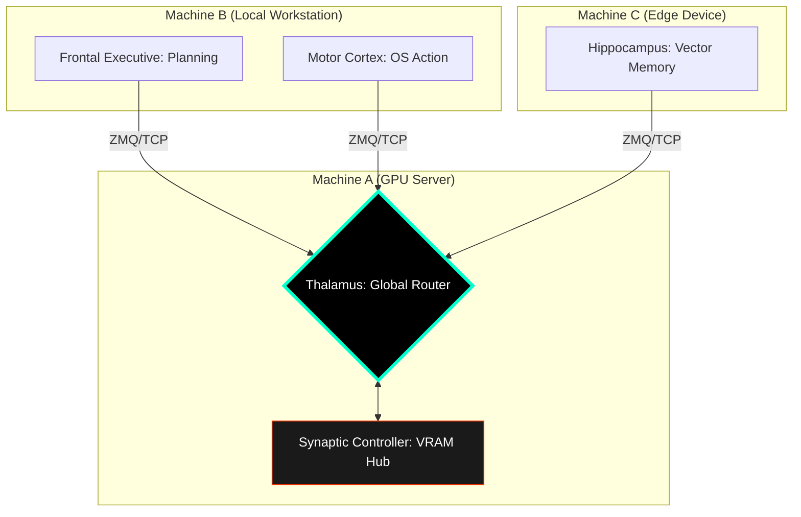

# NeuroSwarm: Principles of Digital Functional Neuro-Anatomy

<div align="center">
  <h3>An Asynchronous Orchestration Framework for Autonomous Cognitive Emulation</h3>
  <p>Technical Specification v1.6.0 | Semantic & Distributed Implementation</p>
</div>

---

## I. Abstract
**NeuroSwarm** is a distributed system designed to emulate the functional partitioning, homeostatic regulation, and endogenous activity of the human brain. v1.6.0 introduces **Semantic Memory** and **Distributed Node Clusters**, allowing specialized lobes to operate across multiple physical machines while maintaining a unified cognitive state.

## II. The Distributed Hierarchy

### 1. The Neural Bus (Thalamus v2)
The Thalamus now operates as a **Global Dispatcher**. It binds to `0.0.0.0`, enabling lobes on different hardware (e.g., Raspberry Pi, Remote GPU Servers) to connect to the central nervous system via the `--thalamus <IP>` protocol.

### 2. Semantic Memory (Vector Hippocampus)
Memory retrieval has evolved from keyword-matching to **Neural Vector Search**.
*   **Embeddings:** The `ModelManager` generates high-dimensional semantic vectors for every engram.
*   **Cosine Similarity:** The Hippocampus performs mathematical comparisons to find memories that are conceptually related to the current goal, even if the wording differs.

### 3. Functional Lobes (The Distributed Swarm)
Lobes are now location-agnostic. 
*   **Synaptic Controller:** Can be hosted on a high-VRAM GPU server.
*   **Motor Lobe:** Can run locally on the user's machine to execute OS commands.
*   **Frontal Executive:** Acts as the decentralized orchestrator.

---

## III. System Innovation: Distributed LoRA Multiplexing



---

## IV. Operational Benchmarks (v1.6.0)

| Metric | Specification |
| :--- | :--- |
| **Search Mode** | Semantic (Neural Embedding) |
| **Node Support** | Distributed (TCP/IP) |
| **Embedding Engine** | Llama.cpp (llama_get_embeddings) |
| **Communication** | ZeroMQ v4.3.x (Asynchronous) |

## V. Awakening Sequence (Distributed)
```bash
# Start Thalamus on Central Machine (IP: 192.168.1.10)
./build/thalamus

# Connect a Lobe from another machine
./build/motor_lobe --thalamus 192.168.1.10
```

---
*NeuroSwarm: Advancing the frontier of distributed digital intelligence.*
