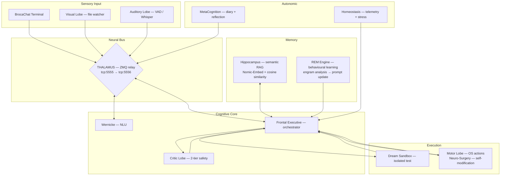

# NeuroSwarm: Distributed Cognitive Architecture

<div align="center">
  
  
  
  <br>
  <h3>A biomimetic multi-agent framework for autonomous cognitive emulation</h3>
</div>

---

## I. Core Idea

NeuroSwarm rejects the monolithic LLM paradigm. Instead of one large model doing everything, it implements Marvin Minsky's **Society of Mind**: many small specialised processes collaborating through a shared neural bus, producing emergent intelligence from their interactions.

Each "lobe" is an independent process with a specific cognitive function. They communicate exclusively via ZeroMQ PUB/SUB. No lobe knows about the internals of another — only the message format.

> *"A brain is not an intelligent 'thing', it is a set of 'small idiot agents' that, by collaborating, create emergent intelligence."* — Marvin Minsky

---

## II. Architecture



---

## III. Cognitive Cycle

Every stimulus follows the same pipeline:

```
1. Stimulus arrives (user input / visual change / idle timer)
2. FrontalExecutive queries Hippocampus → retrieves similar past experiences
3. FE generates a plan (JSON-constrained LLM inference, grammar-enforced)
4. CriticLobe validates the plan:
      Tier 1 — rule-based blacklist (instant reject for destructive commands)
      Tier 2 — LLM evaluation via SynapticController
5. If APPROVED → Dream Sandbox (isolated filesystem test)
6. If dream succeeds → Reality Collapse (MotorLobe executes for real)
7. Result fed back to FE via proprioception
8. Hippocampus indexes successful executions with Nomic-Embed vector
9. During idle → REM Engine analyses engrams, rewrites behavioural prompt
```

---

## IV. Self-Improvement Loop

NeuroSwarm learns from experience in two complementary ways:

**Episodic Memory (Hippocampus)**
Every successful command is embedded with `nomic-embed-text-v1.5` (137M, dedicated) and stored in `data/engrams/memory_index.jsonl`. New tasks query this index via cosine similarity. The system reuses solutions it has already discovered.

**Behavioural Learning (REM Engine)**
During sleep cycles (triggered by Homeostasis when CPU is idle), the REM Engine analyses the last 100 execution traces:
- Calculates success rate per mode (reality / dream / neuro_surgery)
- Identifies command patterns correlated with success/failure
- Writes `data/system_knowledge.md`
- Broadcasts a `prompt_update` — FrontalExecutive injects this into every future prompt

The system never modifies its model weights. It improves by accumulating better context.

**Neuro-Surgery (Self-Modification)**
The MotorLobe can compile new C++ lobes (`.so`) via GCC and the CerebralMatrix can load them at runtime via `dlopen` — adding capabilities without restarting.

---

## V. Component Map

| Process | Binary | Function |
|---|---|---|
| **Thalamus** | `thalamus` | ZMQ relay — all messages pass through here |
| **SynapticController** | `synaptic_controller` | LLM inference server (Qwen 1.5B + Nomic-Embed 137M) |
| **FrontalExecutive** | `frontal_executive` | Orchestrator — goal management, memory retrieval, planning |
| **CriticLobe** | `critic_lobe` | Two-tier plan validation (rules + LLM) |
| **MotorLobe** | `motor_lobe` | Command execution, dream sandbox, neuro-surgery |
| **Hippocampus** | `hippocampus` | Semantic memory — embedding index + cosine search |
| **REM Engine** | `rem_engine` | Sleep-cycle learning — engram analysis + prompt evolution |
| **Homeostasis** | `homeostasis` | System telemetry — CPU/RAM/GPU + stress signals |
| **WernickeLobe** | `wernicke_lobe` | Natural language understanding |
| **Amygdala** | `amygdala` | Emotional gating — priority and stress tagging |
| **MetaCognition** | `metacognition` | Self-reflection diary |
| **VisualLobe** | `visual_lobe` | Filesystem watcher — detects environmental changes |
| **AuditoryLobe** | `auditory_lobe` | Voice input via Whisper.cpp |
| **Visualizer** | `visualizer` | 3D neural mesh dashboard (port 8080) |
| **CerebralMatrix** | `CerebralMatrix` | Process manager — forks all lobes |

---

## VI. Message Protocol

Every message on the bus is a JSON object with these mandatory fields:

```json
{
  "cid":    "unique correlation id",
  "origin": "sending lobe name",
  "intent": "what this message does"
}
```

Key intents: `stimulus`, `inference_request`, `inference_result`, `critic_validate`, `critic_result`, `execution_request`, `execution_result`, `search_memory`, `search_result`, `embedding_request`, `embedding_result`, `prompt_update`, `initiate_sleep_cycle`.

Full spec: [`docs/SYNAPTIC_PROTOCOL.md`](docs/SYNAPTIC_PROTOCOL.md)

---

## VII. Stack

| Layer | Technology |
|---|---|
| **Neural Bus** | ZeroMQ PUB/SUB |
| **Inference** | llama.cpp (Vulkan/GPU) — Qwen2.5-1.5B |
| **Embeddings** | nomic-embed-text-v1.5 (dedicated 137M model) |
| **Memory index** | Cosine similarity over JSONL (no external DB) |
| **Safety** | Two-tier CriticLobe + Dream Sandbox filesystem isolation |
| **Self-modification** | GCC + dlopen for runtime lobe injection |
| **Observability** | Three.js + Chart.js dashboard via cpp-httplib |
| **Build** | CMake + C++17 |

---

## VIII. Deployment

```bash
# 1. Build
mkdir build && cd build
cmake .. && make -j$(nproc)
cd ..

# 2. Download models (first time only)
python3 -c "
from huggingface_hub import hf_hub_download
hf_hub_download('Qwen/Qwen2.5-1.5B-Instruct-GGUF',
                'qwen2.5-1.5b-instruct-q4_k_m.gguf', local_dir='models')
hf_hub_download('nomic-ai/nomic-embed-text-v1.5-GGUF',
                'nomic-embed-text-v1.5.Q8_0.gguf', local_dir='models')
"

# 3. Start
bash start_agi.sh

# 4. Talk to it
./build/broca_chat

# 5. Monitor (browser)
open http://localhost:8080
```

---

## IX. Roadmap

- [ ] **Ralph loop** — structured `tasks.json` with `passes:true/false`, git commit after each success
- [ ] **Polecat workers** — ephemeral genesis lobes spawned per task, die on completion
- [ ] **Specialised models** — Qwen-Coder for MotorLobe, Phi-3 for CriticLobe
- [ ] **Python-generated lobes** — easier for small models to write than C++
- [ ] **REM fine-tuning** — when enough successful traces exist, LoRA fine-tune on a full-precision model

---

*Intelligence is not in the size of the model. It is in the complexity of the connections.*
