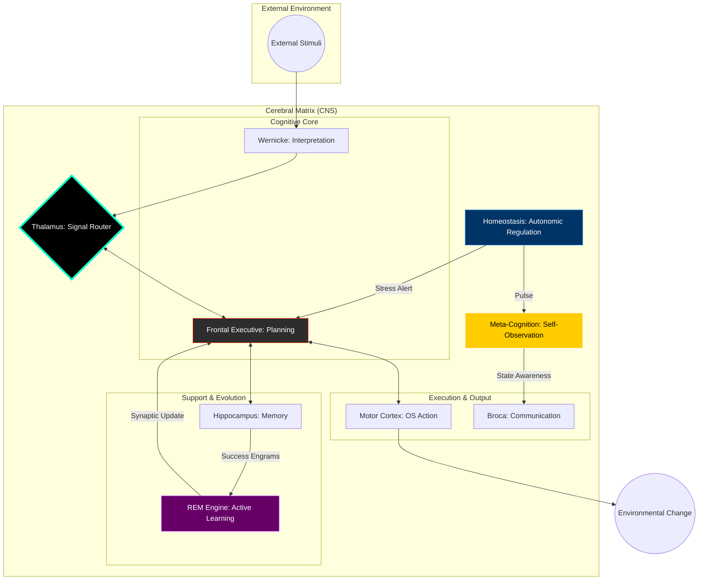

# NeuroSwarm: Principles of Digital Functional Neuro-Anatomy

<div align="center">
  <h3>An Asynchronous Orchestration Framework for Autonomous Cognitive Emulation</h3>
</div>

---

## I. Abstract
**NeuroSwarm** is a distributed system designed to emulate the functional partitioning, homeostatic regulation, and endogenous activity of the human brain. Unlike traditional Large Language Models (LLMs) which operate as reactive, monolithic inference engines, NeuroSwarm implements a **Decentralized Cortical Matrix**. 

By mapping specific cognitive functions to independent "lobes" (C++ processes) and synchronizing them via a high-speed neural bus, the framework achieves emergent autonomy. The system's intelligence is derived not from parameter count alone, but from the **Iterative Resonance**, **Active Learning**, and **Meta-Cognitive Reflection** between its specialized sub-components.

## II. The Cortical Hierarchy

The NeuroSwarm architecture is strictly partitioned into functional regions, each emulating a biological counterpart:

### 1. The Autonomic System (Brainstem & Homeostasis)
The "Heartbeat" and "Vitals" of the system.
*   **CerebralMatrix:** Manages the lifecycle and regenerative restart of all neural processes.
*   **Homeostasis:** Monitors resource pressure and **Task Success Rates**. It regulates the system's "Stress Level," triggering adrenaline-style reasoning or autonomous sleep cycles.

### 2. The Meta-Cognitive Layer (The "Cogito" Phase)
The system's self-reflective observer. It monitors homeostatic stress and evolution cycles, generating a **Thought Stream Diary** (`logs/THOUGHTS.md`). It provides real-time "emotional" feedback (Stress Level) to the communication interface.

### 3. The Frontal Executive & DMN
The seat of volition. It manages high-level goals through a structured **Chain-of-Thought** protocol.
*   **Active Mode:** Strategic planning, task delegation, and stress-aware reasoning.
*   **Default Mode Network (DMN):** In the absence of stimuli, the Executive enters **Endogenous Rumination** for internal auditing.

### 4. Semantic Processing (Wernicke & Broca)
*   **Wernicke Lobe:** Semantic interpreter decoding raw input into structured "intent-objects."
*   **Broca Lobe:** Articulatory engine. In v1.5.0, it integrates **Internal State Visualization**, displaying the system's stress level in the interactive prompt.

### 5. Memory & Evolution (Hippocampus & REM Engine)
*   **Hippocampus:** Manages **Engram Traces** (long-term persistence) and RAG indexing.
*   **REM Engine:** The **Active Learning** core. During idle periods, it extracts successful execution patterns and performs autonomous **LoRA Fine-tuning**.

---

## III. Core Innovation: Self-Evolution & Reflection

NeuroSwarm is a **self-optimizing organism**. It learns from its successes and observes its own operational stress.



---

## IV. Operational Benchmarks (GTX 1080 Ti)

| Functional Metric | Specification |
| :--- | :--- |
| **Neural Signal Latency** | < 0.5ms (Inter-process) |
| **Learning Rate** | Autonomous SFT (10 epochs/cycle) |
| **Meta-Cognitive Pulse** | 5min Reflection Interval |
| **Autonomic Triggers** | 1s Pulse / 60s Idle Threshold |

## V. Deployment Protocol

### Awakening Sequence
```bash
# Build and Run
mkdir build && cd build
cmake .. && make -j$(nproc)
./scripts/neuroswarm_daemon.sh

# Interact with the Meta-Aware Brain
./build/broca_chat
```

---
