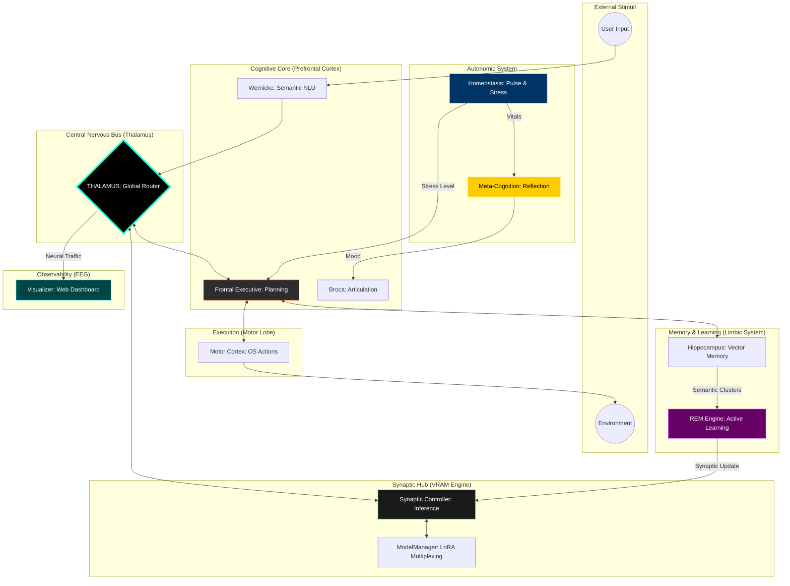

# NeuroSwarm: Principles of Digital Functional Neuro-Anatomy

<div align="center">
  <h3>An Asynchronous Orchestration Framework for Autonomous Cognitive Emulation</h3>
  <p>Technical Specification v1.7.0 | Distributed & Observable Implementation</p>
</div>

---

## I. Abstract
**NeuroSwarm** is a distributed system designed to emulate the functional partitioning, homeostatic regulation, and endogenous activity of the human brain. v1.7.0 introduces **Neural Observability (EEG)**, providing a real-time visual dashboard of the system's internal stimuli and cognitive state.

## II. System Anatomy: The Functional & Distributed Matrix

NeuroSwarm operates as a **Decentralized Cortical Matrix**. Lobes communicate via the Thalamus, allowing for a self-evolving system that can be spread across multiple physical nodes.



## III. Core Innovation: Neural Observability

v1.7.0 adds the **Visualizer Lobe**, a dedicated EEG-like interface that captures the asynchronous traffic of the Thalamus.
*   **Real-Time Dashboard:** Served at `http://localhost:8080`.
*   **Lobe Activity Monitor:** Visualizes which regions of the "brain" are firing in response to specific stimuli.
*   **Engram Stream:** A live feed of intent-objects flowing through the nervous bus.

---

## IV. Operational Benchmarks (v1.7.0)

| Metric | Specification |
| :--- | :--- |
| **Search Mode** | Semantic (Neural Embedding) |
| **Observability** | Real-time Web Dashboard (8080) |
| **Node Support** | Distributed (TCP/IP) |
| **Communication** | ZeroMQ v4.3.x (Asynchronous) |

## V. Awakening Sequence
```bash
# Compile and Start the Matrix
./scripts/neuroswarm_daemon.sh

# Watch the Brain Thinking
# Open http://localhost:8080 in your browser

# Talk to the system
./build/broca_chat
```

---
*NeuroSwarm: Advancing the frontier of distributed digital intelligence.*
