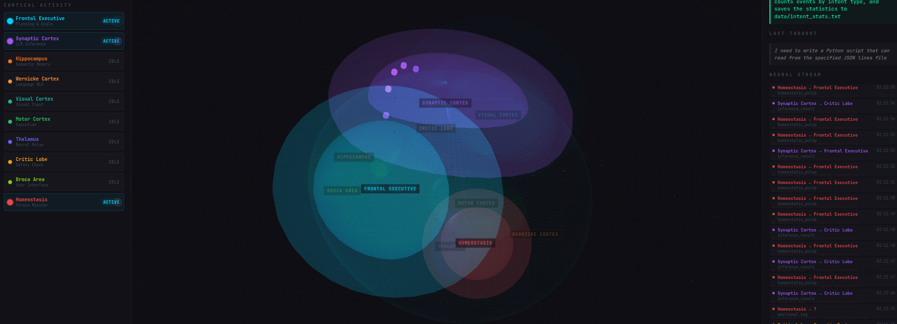
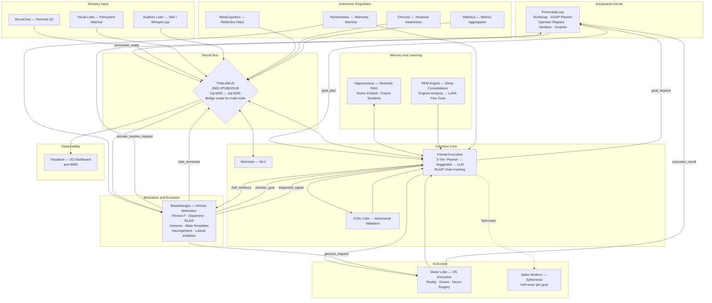

# NeuroSwarm: Distributed Cognitive Architecture

<div align="center">
  
  
  
  
  <br><br>
  <h3>A biomimetic cognitive architecture that bootstraps from zero knowledge</h3>
  <p><em>Autopoiesis, intrinsic motivation, and structural self-modification in a distributed C++ system</em></p>
</div>

---

<div align="center">
  
  <br>
  <sub>Real-time cognitive dashboard — 2D network graph with density clusters, Maslow drive hierarchy, neurogenesis metrics, spike task ticker</sub>
</div>

---

## I. Core Concept

NeuroSwarm is a **computational organism** built on five hardcoded axioms: **Execution** (act and observe), **Surprise** (prediction error as drive), **Associative Memory** (store state-action pairs), **Variation** (blind mutation of learned operators), and **Self-Reference** (maintain a boundary between self and world). Everything beyond these axioms — sensors, tools, specialist lobes, world knowledge — is procedurally generated through experience.

The system starts knowing **nothing** about its host. It discovers users, filesystems, binaries, network topology, and programming languages through direct probing (PrimordialLoop bootstrap). It plans using a **GOAP backward-chaining planner** over learned operators, generates novel operators through **genetic variation** tested in a sandboxed dream environment, and autonomously **spawns new specialist lobes** when capability domains chronically fail.

Each *lobe* is an independent OS process with a precisely scoped cognitive function. Communication is exclusively via ZeroMQ PUB/SUB. No lobe has visibility into the internals of another — only the message schema is shared. This yields a system that is:

- **Self-bootstrapping** — discovers its environment from zero, persists state, runs incremental bootstrap on restart
- **Self-planning** — GOAP planner over learned operators, no LLM needed for known goals
- **Self-extending** — neurogenesis pipeline generates, compiles, and injects specialist C++ lobes at runtime
- **Self-healing** — crash detection, exponential backoff restart, domain resolution before neurogenesis
- **Observable** — all inter-lobe state is visible on the bus and rendered on a real-time dashboard
- **Distributed** — deploys copies of itself to remote machines via SSH, synchronises learned operators

---

## II. Architecture



---

## III. The Cognitive Cycle

The system runs a continuous autonomous loop with no external prompting:

```
1. BasalGanglia evaluates F(d) for all 14 domains → selects highest-priority goal
2. FrontalExecutive receives goal → enters three-tier execution pipeline:
      Tier 1 — GOAP Planner: maps domain to postcondition, backward-chains through
               learned operators. If a plan exists, execute steps sequentially via MotorLobe
      Tier 2 — Suggested Commands: try BasalGanglia's domain-specific command templates
      Tier 3 — LLM Oracle: structured prompt → local inference → grammar-constrained output
3. CriticLobe validates the action (pattern blacklist + scope check + adversarial LLM)
4. MotorLobe executes (reality / dream / neuro-surgery mode)
5. PrimordialLoop learns: successful command → new operator with inferred postconditions
6. BasalGanglia updates domain statistics and prediction errors
7. Hippocampus stores the execution as an episodic engram
8. If stamina low → REM Engine consolidates memories, fine-tunes local model
9. If domain chronically failing → domain resolution → variation → neurogenesis
```

The three-tier pipeline ensures the LLM is a **last resort**. As the operator registry grows, Tier 1 resolves an increasing fraction of goals without any LLM call.

---

## IV. Bootstrap and Autopoiesis

### PrimordialLoop — From Zero to Operational

The PrimordialLoop is the first process launched. It encodes 5 axioms and runs 7 sequential phases:

| Phase | Name | Action |
|-------|------|--------|
| 0 | Existence | Confirm ability to execute and observe |
| 1 | First Contact | `whoami`, `hostname`, `uname`, `$HOME`, `$PATH` → self-model |
| 2 | Capability Discovery | Enumerate `$PATH` binaries, test write permissions |
| 3 | Sense Acquisition | Network, GPU, audio, display detection (always re-probes) |
| 4 | Tool Discovery | Programming languages and compilers |
| 5 | Active Exploration | Probe unknown binaries (`--help`, 1s timeout, skip GUI apps) |
| 6 | Planner Self-Test | Initialize GOAP planner, run canary plan |
| 7 | Network Expansion | Discover SSH hosts, deploy kernel, sync operators |

Each successful probe becomes a **learned operator** — a reusable action template with command, preconditions, postconditions, success rate, and fragments for recombination. Operators persist to `data/operators.jsonl`.

On subsequent startups, persisted state is loaded and phases skip known results. Bootstrap drops from ~60s to ~10s.

### Intrinsic Motivation (BasalGanglia)

BasalGanglia tracks 14 capability domains (`file_read`, `file_write`, `compilation`, `network_diagnostics`, etc.) and selects goals via a fitness function:

```
F(d) = 0.20 * Coverage + 0.15 * Trend + 0.30 * PredictionError + 0.25 * Novelty - 0.10 * Stress
```

Drive hierarchy (Maslow-inspired): SURVIVAL → HOMEOSTASIS → EXPLORATION → MASTERY → SELF_MODIFY. Higher drives preempt lower ones. On novel capability discovery, a `dopamine_signal` is broadcast.

### Domain Resolution Pipeline

Before neurogenesis, chronic failures go through a 4-stage resolution pipeline in the PrimordialLoop:

```
Variation (blind mutation) → Mutation (targeted) → Planner (find operator chain) → LLM Oracle
```

Each stage tests candidates in the Dream Sandbox. Only if all four fail does BasalGanglia trigger neurogenesis.

---

## V. Memory Architecture

NeuroSwarm maintains three complementary memory systems:

**Procedural Memory (Operator Registry)**
Every learned action is stored as an `Operator` — a command template with preconditions, postconditions, success rate, duration stats, and decomposed fragments for genetic recombination. Operators are learned from bootstrap probing, runtime execution, variation, and LLM generation. Operators with success rate ≥80% over ≥5 uses are *stable*; those with <10% over ≥20 uses are *dying* and get pruned (apoptosis). Persisted to `data/operators.jsonl` (append-only JSONL).

**Episodic Memory (Hippocampus)**
Successful executions are embedded with `nomic-embed-text-v1.5` (137M parameters) and stored in `data/engrams/`. New tasks query this index via L2-normalised cosine similarity. Recent engrams are weighted higher than stale ones (time-decay via ChronosLobe timestamps).

**Behavioural Learning (REM Engine)**
During sleep cycles (triggered by low stamina), the REM Engine consolidates transient execution traces into permanent engrams and exports successful sequences as LoRA fine-tuning data for the local model.

**Runtime Learning**
Every successful `execution_result` from the MotorLobe triggers `learn_from_execution()` in the PrimordialLoop. New operators are created with inferred postconditions based on command patterns (e.g., `cat` → `can_read_file`, `mkdir` → `can_create_directory`). This closes the learning loop: goals → execution → operators → planner → goals.

---

## VI. Neuro-Surgery & Neurogenesis: Runtime Self-Modification

The system is capable of modifying and extending its own implementation at runtime through two mechanisms:

### Neuro-Surgery (Self-Modification)
1. FrontalExecutive generates a patch (shell command sequence targeting source files)
2. CriticLobe validates the patch against the three-tier safety pipeline
3. MotorLobe executes: `patch source → cmake → make -j$(nproc)` inside the `neuro_surgery` execution mode
4. On successful build, the modified lobe is restarted by CerebralMatrix

### Neurogenesis (Self-Extension)
1. BasalGanglia detects chronic failure in a capability domain (<30% success rate over 20+ attempts)
2. A specialist lobe is generated from a parameterised C++ template with domain-specific knowledge
3. MotorLobe compiles it as a standalone executable: `g++ -std=c++17 -o build/{NAME}`
4. CerebralMatrix receives an `inject_lobe` signal, validates the binary, and `fork()`/`exec()`s it as a live process
5. The specialist monitors its domain on the bus, publishes `specialist_advice` and `specialist_report`

### Apoptosis (Self-Pruning)
Lobes that are no longer useful can be terminated via `lobe_terminate` signals. CerebralMatrix sends `SIGTERM`, waits, then `SIGKILL` if necessary.

This enables structural adaptation without system restart — analogous to adult hippocampal neurogenesis and programmed cell death in biological neural development.

---

## VII. Component Map

| Process | Binary | Cognitive Function |
|---|---|---|
| **CerebralMatrix** | `CerebralMatrix` | Process supervisor — forks all lobes, crash detection with exponential backoff, neurogenesis injection, apoptosis termination, orphan cleanup |
| **PrimordialLoop** | `primordial_loop` | Autopoiesis kernel — bootstrap from zero, GOAP planner, operator registry, variation engine, surprise engine, runtime learning, network expansion |
| **Thalamus** | `thalamus` | ZMQ XPUB/XSUB relay — all messages transit this single bottleneck |
| **SynapticController** | `synaptic_controller` | LLM inference server — Phi-4-mini (generative) + Nomic-Embed (semantic), multi-slot ModelManager |
| **FrontalExecutive** | `frontal_executive` | 3-tier execution: Planner → Suggested Commands → LLM. Goal pursuit, plan execution |
| **CriticLobe** | `critic_lobe` | Three-tier adversarial validation: pattern blacklist + scope check + red-team LLM |
| **MotorLobe** | `motor_lobe` | Command execution in 3 modes: reality, dream (sandboxed), neuro-surgery (self-modification) |
| **Hippocampus** | `hippocampus` | Semantic episodic memory — Nomic-Embed embedding index + cosine retrieval |
| **REM Engine** | `rem_engine` | Sleep-cycle learning — engram consolidation + LoRA fine-tuning |
| **Homeostasis** | `homeostasis` | System telemetry — CPU/RAM/GPU monitoring, stamina management, stress signalling |
| **WernickeLobe** | `wernicke_lobe` | Natural language understanding — intent classification, entity extraction |
| **Amygdala** | `amygdala` | Emotional gating — priority assignment and stress tagging |
| **MetaCognition** | `metacognition` | Self-reflective diary — internal state narration |
| **VisualLobe** | `visual_lobe` | Filesystem watcher — detects environmental state changes |
| **AuditoryLobe** | `auditory_lobe` | Voice input pipeline via Whisper.cpp |
| **Visualizer** | `visualizer` | 2D network graph dashboard (Canvas, port 8080) |
| **ChronosLobe** | `chronos_lobe` | Temporal awareness — time_pulse with ISO timestamp, uptime, circadian phase |
| **StatisticsLobe** | `statistics_lobe` | Passive bus observer — per-cycle metrics to `data/metrics/` in JSONL |
| **BasalGanglia** | `basal_ganglia` | Intrinsic motivation — self-model, fitness function, dopamine signals, neurogenesis trigger |
| **SpikeWorker** | `spike_worker` | Ephemeral per-goal worker — fork+exec'd by FE, auto-terminates on completion |
| *Specialists* | `build/{domain}_specialist` | Runtime-generated lobes for chronically failing domains (via neurogenesis) |

---

## VIII. Message Protocol

Every message on the neural bus is a JSON object with these mandatory fields:

```json
{
  "cid":    "uuid4 — correlation identifier, threads related messages",
  "origin": "source lobe name",
  "intent": "semantic action descriptor"
}
```

Core intents:

| Intent | Direction | Description |
|---|---|---|
| `stimulus` | → FE | Raw user or sensor input |
| `inference_request` | → SC | Request LLM generation |
| `inference_result` | SC → | Generated text response |
| `critic_validate` | → CL | Plan submitted for safety review |
| `critic_result` | CL → | APPROVED or rejection rationale |
| `execution_request` | → ML | Command to execute |
| `execution_result` | ML → | stdout, exit code, mode |
| `search_memory` | → HP | Semantic query |
| `search_result` | HP → | Top-k similar engrams |
| `prompt_update` | REM → | Evolved behavioural context |
| `initiate_sleep_cycle` | HM → | Trigger REM processing |
| `time_pulse` | CH → | ISO timestamp, uptime, time-of-day, is_night |
| `intrinsic_goal_request` | FE → BG | Request next intrinsic motivation goal |
| `intrinsic_goal` | BG → FE | Domain, fitness score, suggested commands |
| `intrinsic_goal_result` | FE → BG | Completion/failure report for self-model update |
| `dopamine_signal` | BG → | Novel capability discovery or prediction error surprise |
| `self_model_updated` | BG → | Domain state changed in `data/self_model.json` |
| `spike_ready` | SW → FE | Worker announces readiness after fork+exec |
| `spike_assign` | FE → SW | Goal assignment dispatched to specific worker |
| `spike_done` | SW → FE | Worker completed/failed goal, reports result |
| `genesis_request` | BG → ML | Request compilation of a new specialist lobe |
| `genesis_result` | ML → BG | Compilation success/failure report |
| `inject_lobe` | ML → CM | Request CerebralMatrix to spawn a new lobe process |
| `lobe_injected` | CM → | Confirmation that a new lobe is running |
| `lobe_terminate` | → CM | Request to terminate a running lobe (apoptosis) |
| `lobe_terminated` | CM → | Confirmation that a lobe was terminated |
| `lobe_crash` | CM → | Notification that a lobe process crashed |
| `lobe_death` | CM → | Lobe exceeded max restarts, marked permanently dead |
| `specialist_advice` | SP → | Domain-specific pre-validation and command alternatives |
| `specialist_report` | SP → BG | Periodic specialist performance metrics |
| `homeostatic_pulse` | HM → | System telemetry: success rate, stamina, CPU/RAM/GPU |
| `primordial_ready` | PL → | Bootstrap complete — operators and world state available |
| `goal_plan_request` | FE → PL | Request GOAP plan for a domain postcondition |
| `goal_plan` | PL → FE | Plan steps (operator sequence) or failure with gaps |
| `domain_resolve_request` | BG → PL | Try variation/mutation/planner/LLM before neurogenesis |
| `domain_resolve_result` | PL → BG | Resolution success/failure for chronic domain |
| `operator_request` | → PL | Request an operator by postcondition |
| `kernel_deployed` | NE → | Remote kernel binary deployed via SSH |
| `remote_kernel_started` | NE → | Remote PrimordialLoop instance started |
| `rlaif_reinforce` | FE → BG | Reinforcement signal with executed command chain and magnitude |
| `operators_synced` | NE → | Novel operators imported from remote instance |

Full specification: [`docs/SYNAPTIC_PROTOCOL.md`](docs/SYNAPTIC_PROTOCOL.md)

---

## IX. Stack

| Layer | Technology |
|---|---|
| **Neural Bus** | ZeroMQ 4.x — PUB/SUB, non-blocking |
| **Inference** | llama.cpp (Vulkan/GPU offload) — Phi-4-mini-instruct Q4_K_M |
| **Embeddings** | nomic-embed-text-v1.5 Q8_0 — dedicated 137M model, mean pooling |
| **Memory Index** | L2-normalised cosine similarity over JSONL (zero external dependencies) |
| **Grammar Constraints** | GBNF — llama.cpp grammar-constrained decoding for structured JSON output |
| **Safety** | Three-tier CriticLobe (blacklist + scope + LLM) + Dream Sandbox filesystem isolation |
| **Self-Modification** | GCC standalone executable compilation + CerebralMatrix fork/exec injection |
| **Observability** | HTML5 Canvas + cpp-httplib — 2D network graph with density clusters |
| **Build System** | CMake 3.16+ / C++17 |
| **OS** | Linux (Vulkan compute) |

---

## X. Deployment

```bash
# 1. Build
mkdir build && cd build
cmake .. && make -j$(nproc)
cd ..

# 2. Download models (first time only)
python3 -c "
from huggingface_hub import hf_hub_download
# Primary: Phi-4-mini — best quality/size ratio for <12GB VRAM
hf_hub_download('unsloth/Phi-4-mini-instruct-GGUF',
                'Phi-4-mini-instruct-Q4_K_M.gguf', local_dir='models')
# Semantic memory
hf_hub_download('nomic-ai/nomic-embed-text-v1.5-GGUF',
                'nomic-embed-text-v1.5.Q8_0.gguf', local_dir='models')
"

# 3. Launch all processes
bash start_agi.sh

# 4. Open a conversation
./build/broca_chat

# 5. Monitor (browser)
xdg-open http://localhost:8080
```

**Hardware requirements:** GPU with Vulkan support, ≥8GB VRAM recommended. Tested on GTX 1080 Ti (11GB). CPU fallback available.

---

## XI. Roadmap

- [x] **Ralph loop** — `tasks.json`-driven autonomous self-improvement with `git commit` audit trail
- [x] **Phi-4-mini** — primary generative model (3.8B, Q4_K_M, 2.4GB)
- [x] **Dream Sandbox** — isolated filesystem execution before reality deployment
- [x] **Neuro-Surgery** — runtime C++ lobe compilation and process injection
- [x] **Cognitive Dashboard** — 2D network graph with density clusters, Maslow drive hierarchy, neurogenesis/apoptosis metrics, spike task ticker
- [x] **GBNF grammar constraints** — structured JSON output from LLM inference
- [x] **Adversarial Critic** — nuclear-only pattern blacklist (~10 catastrophic signatures: disk wipe, fork bombs, credential exfiltration), deterministic scope validation rejecting paths outside the project directory, adversarial red-team LLM prompt with reject-by-default framing. Rate limiting prevents inference flooding during neurotic loops (max 6 evaluations per CID per 60s)
- [x] **Intrinsic motivation (BasalGanglia)** — self-model tracking 14 capability domains with fitness function F(d) based on Free Energy Principle (coverage, trend, prediction error, novelty, stress). Replaces LLM task generation with deterministic goal selection. Three-tier FrontalExecutive: external tasks → intrinsic goals → epistemic fallback. Dopamine signals on novel capabilities. Learned helplessness cooldowns
- [x] **ChronosLobe** — temporal awareness for the swarm: broadcasts a `time_pulse` event every second containing ISO timestamp, system uptime, time-of-day, and day-of-week. FrontalExecutive injects current time and task elapsed duration into every prompt, enabling the model to reason about urgency and task staleness. Hippocampus uses timestamps for memory decay — recent engrams weighted higher than stale ones. Foundation for circadian scheduling in Homeostasis (reduced activity at night, deeper REM cycles)
- [x] **StatisticsLobe** — passive bus observer that records per-cycle metrics to `data/metrics/` in JSONL (Ralph cycle duration, retry count, Critic decisions, Hippocampus similarity scores, inference tokens/sec). Zero interference with cognition. Required for empirical evaluation
- [x] **Spike workers** — ephemeral fork+exec'd processes per goal, CID-isolated cognitive cycle (memory → thought → critic → dream → reality), 120s idle timeout, max 2 concurrent workers. FrontalExecutive delegates Ralph, intrinsic, and external goals to workers when capacity allows. User stimuli always handled inline for immediate response
- [x] **Specialised routing** — XPUB/XSUB topic-based intent filtering via Thalamus proxy. Each lobe subscribes only to its relevant intents at the ZMQ transport layer — messages that don't match never leave the Thalamus. Shared `routing.hpp` header provides `publish()`, `subscribe()`, `subscribe_all()`, `receive()` for all 20+ binaries. Monitoring lobes (Statistics, Visualizer, MetaCognition, Amygdala) subscribe to all traffic
- [x] **Model specialisation** — multi-slot ModelManager with named adapter routing. SynapticController auto-loads specialist GGUFs (Qwen-Coder → "coder" slot, critic model → "critic" slot) with graceful fallback to base model. FrontalExecutive uses "coder" adapter for command generation. CriticLobe Tier 2 LLM validation sends non-safe commands through "critic" adapter with GBNF-constrained safety verdict, 10s fail-open timeout
- [x] **REM fine-tuning** — REM Engine exports successful reality-mode execution traces as chat-template training data and spawns `llama-finetune` (CPU-only, no VRAM conflict) to produce specialised GGUFs. ModelManager supports LoRA adapter loading via `llama_adapter_lora_init` for externally-trained adapters, with per-inference activation/deactivation. SynapticController auto-loads fine-tuned models from `models/finetuned/` and LoRA adapters from `models/lora/` at startup
- [x] **Self-preservation** — CerebralMatrix monitors all child processes via `waitpid(WNOHANG)`, detects crashes with signal/exit-code analysis, auto-restarts with exponential backoff (2s→4s→8s→16s), marks lobes permanently dead after 5 consecutive failures. Orphaned processes from previous sessions cleaned up at startup via `/proc` scan. FrontalExecutive reaps zombie spike workers in idle loop
- [x] **Neurogenesis pipeline** — BasalGanglia detects chronic domain failure (<30% over 20+ attempts) and generates specialist lobes from parameterised C++ templates. MotorLobe compiles as standalone executables. CerebralMatrix validates binaries and injects via `fork()`/`exec()`. Specialists monitor their domain, publish advice and periodic reports. Apoptosis via `lobe_terminate` allows pruning of unneeded specialists
- [x] **Dashboard v2** — 2D Canvas network graph replacing Three.js 3D mesh. 16 core lobe nodes with cluster density clouds, curved bezier edges. Left panel: active lobes, Maslow drive hierarchy (colour-coded), system metrics (success rate, stamina, tasks done, REM cycles), neurogenesis stats (specialists/genesis/apoptosis). Bottom: spike task ticker with chronological task entries. Dynamic specialist nodes appear/disappear with neurogenesis/apoptosis events
- [x] **Autopoiesis kernel (PrimordialLoop)** — bootstrap from zero knowledge through 7 phases: existence → first contact → capability discovery → sense acquisition → tool discovery → active exploration → planner self-test. 5 axioms hardcoded (Execution, Surprise, Associative Memory, Variation, Self-Reference). Persists world state and self-model across restarts for incremental bootstrap (~10s vs ~60s)
- [x] **GOAP Planner** — backward-chaining search over learned operators. Maps goal postconditions to operator chains. Reports gaps (unsatisfiable postconditions) that trigger operator generation. No LLM involved — pure graph search
- [x] **Operator Registry** — persistent procedural memory. Operators learned from bootstrap, runtime execution, variation, and LLM. Track success rate, duration, fragments for recombination. Append-only JSONL with periodic prune (apoptosis for dying operators)
- [x] **Variation Engine** — 5 strategies: template filling, recombination (crossover), mutation (flag/fragment perturbation), fragment assembly, targeted variation. Candidates tested in Dream Sandbox before promotion
- [x] **Surprise Engine** — prediction error model combining success/failure prediction (60%) and output novelty (40%). Sliding window trend detection. Global surprise metric for bootstrap completeness
- [x] **Three-tier execution** — FrontalExecutive: Planner → Suggested Commands → LLM Oracle. Planner gates on `primordial_ready` signal. Multi-step plan execution with per-step result checking. Fallback chain with no delay between tiers
- [x] **Runtime learning** — every successful `execution_result` creates a new operator with inferred postconditions (pattern-based: `cat`→`can_read_file`, `mkdir`→`can_create_directory`, `g++`→`can_compile`, etc.). Closes the learning loop: goals → execution → operators → planner → goals
- [x] **Network expansion** — SSH-based self-deployment: discover hosts from `~/.ssh/known_hosts` + `~/.ssh/config`, probe reachability, deploy kernel binary via `scp`, start remote instance via `nohup`. Periodic operator sync imports novel operators from remote instances (horizontal gene transfer)
- [x] **Domain resolution pipeline** — before neurogenesis, chronic failures go through 4-stage resolution: variation → mutation → planner → LLM. Each stage tests candidates in Dream Sandbox. Neurogenesis only triggers when all stages fail
- [x] **Postcondition enrichment** — retroactive inference of postconditions for bootstrap-learned operators using command pattern matching. Bridges experiential learning (commands without annotations) and the Planner (requires postconditions)
- [x] **GUI skip list** — PrimordialLoop skips GUI apps, editors, browsers, terminal emulators, window managers, and interactive interpreters during binary probing to avoid launching graphical programs during headless operation
- [x] **RLAIF chain tracking** — FrontalExecutive records full command chains per goal, caches completed chains, and publishes `rlaif_reinforce` on dopamine signals. BasalGanglia boosts genome template fitness proportionally. Chains are consumed after use and deduplicated per domain to prevent multiplied reinforcement
- [x] **Semantic success validation** — `is_substantive_success()` rejects degenerate commands that exit 0 without real work: echo-only commands, `/dev/null` no-ops, and empty output. Applied at BasalGanglia level to both execution results and RLAIF chain reinforcement
- [x] **Lateral inhibition** — competing specialists for overlapping domains are pruned when one handles less than 50% of a rival's commands. Prevents redundant specialist proliferation after neurogenesis
- [x] **Cross-compilation** — NetworkExpander maps 8 architectures (aarch64, armv7l, riscv64, mips, ppc64le, s390x, x86_64, i686) to GNU cross-toolchain compilers for remote kernel deployment on heterogeneous nodes
- [x] **Meta-templates** — specialist C++ template evolves genetically. Population of parameter variants (report interval, cache size, keyword count) with crossover and mutation. Fitness feedback from specialist reports drives selection
- [x] **Runtime assertions** — `NS_ASSERT`, `NS_PRECONDITION`, `NS_POSTCONDITION`, `NS_INVARIANT` macros with JSONL logging to `data/assertions.jsonl`. `ScopedRollback` RAII guard for neuro-surgery. Compilable out with `-DNS_NO_ASSERTIONS`
- [x] **Full system test** — end-to-end test suite (`full_system_test`) verifying Thalamus connectivity, bus round-trip, intrinsic goal cycle, execution pipeline, dopamine signal flow, self-model persistence, and RLAIF reinforcement delivery

---

*Intelligence is not in the size of the model. It is in the complexity of the connections.*
